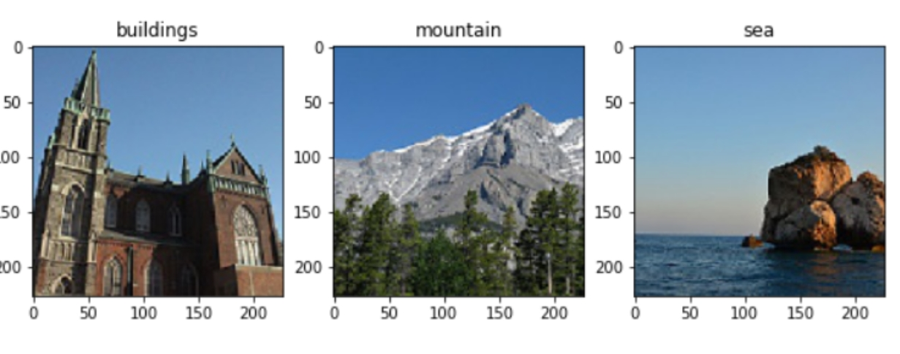
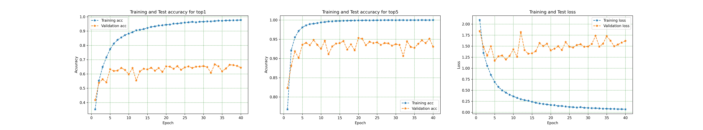
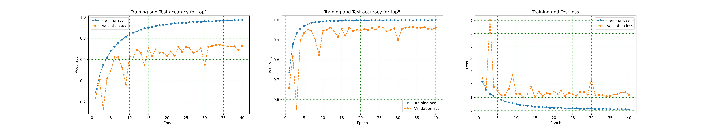
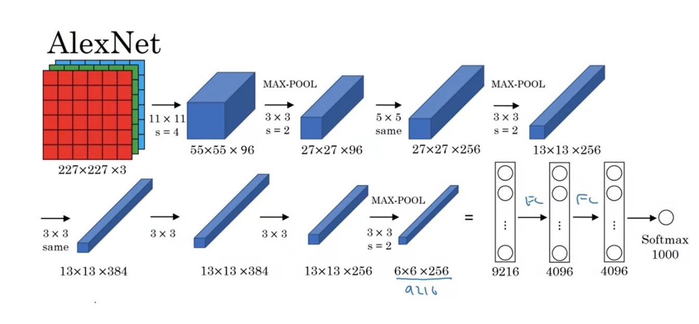
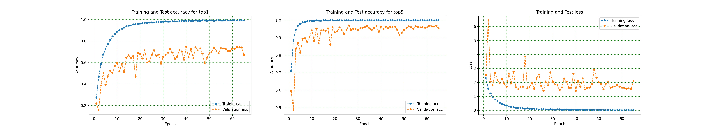
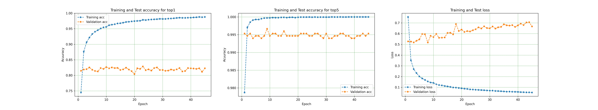
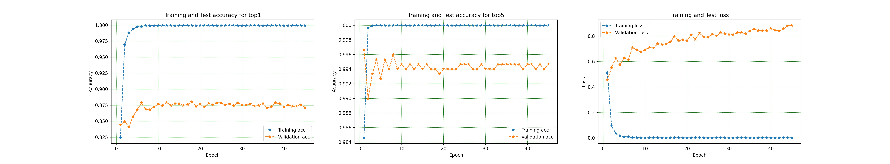

In this project, we implemented five neural network for scene recognition.

all networks inspired by AlexNet architecture, and the 4th and 5th networks are 
using transfer learning from AlexNet network and then fine-tuning for our problem

Dataset Link :

https://drive.google.com/file/d/10FScGS9IXlVRplTWQ1tpBIphfZ3A9_Ui/view?usp=sharing


**1-Extract data from Data.tgz**


```python
import os ,tarfile

f=tarfile.open(os.path.abspath('Data.tgz'), 'r')
for i,row in enumerate(f):
    f.extract(row)

```

**2-Data augmentation and import all data**


our dataset consists of 2985 images for train and 1500 images for test in 15 different classes
here are two examples of them:





Because our dataset is not large enough, we used data augmentation with 15 different methods like applying different perspectives to images, rotating, flipping, adding Gaussian noise, zoom in and zoom out, changing color maps, and drawing small black boxes on images. Finally, we have 44730 images for training.


```python

import os
from importlib.machinery import SourceFileLoader
from keras.preprocessing.image import ImageDataGenerator
import tensorflow as tf
from functions import augment_func


train_path=os.path.join(os.path.abspath("Data"),"Train")
test_path=os.path.join(os.path.abspath("Data"),"Test")


try:
    f = open(os.path.join(train_path,"done.txt"), "r")
    f.close()
except:
    augment_func()


train_data =ImageDataGenerator(rescale=1. / 255)
train = train_data.flow_from_directory(train_path, target_size=(225,225), batch_size=64,class_mode='categorical')


test_data =ImageDataGenerator(rescale=1. / 255)
test = test_data.flow_from_directory(test_path, target_size=(225,225), batch_size=64,class_mode='categorical')

```

**Network1**


network1 consists of one convolutional layer with 96 filters and a kernel size of 11, followed by a pooling and drop-out layer to prevent overfitting.

then we have a fully connected layer and a soft-max layer as a classifier

optimizer is Stochastic gradient descent with a learning rate of 1e-3 and momentum of 0.97, which are our hyperparameters


```python
net1=networks.network1(train[0][0].shape[1:])
[net1 ,train_hist ,test_hist]=functions.fit_model(epoch=40 , model=net1 , Train=train ,Test=test,path='network1')
functions.show_result(train_hist,test_hist,"network1_plot")

```

The results:




*************************


**Network2**


network2 consists of three convolutional layers followed by max-pooling l and drop-out layer after each conv layer 

then we have two fully connected layers and a  soft-max layer as a classifier

Optimizer is Stochastic gradient descent with a learning rate of 1e-3 and momentum of 0.97, which are our hyperparameters.


```python
net2=networks.network2(train[0][0].shape[1:])
[net2 ,train_hist ,test_hist]=functions.fit_model(epoch=40 , model=net2 , Train=train ,Test=test,path='network2')
functions.show_result(train_hist,test_hist,"network2_plot")

```

The result:




*************************


**Network3**


network3 has exactly Alexnet architecture:





```python
net3=networks.network3(train[0][0].shape[1:])
[net3 ,train_hist ,test_hist]=functions.fit_model(epoch=65 , model=net3 , Train=train ,Test=test,path='network3')
functions.show_result(train_hist,test_hist,"network3_plot")

```

The result:




*************************

**Network4**


network4 has exactly Alexnet architecture, but we used transfer learning from the pre-train network on the ImageNet dataset and train only the last layer ( classifier)


```python
trans_img = torchvision.transforms.Compose([torchvision.transforms.Resize(224),
                                            torchvision.transforms.CenterCrop(224),
                                            torchvision.transforms.ToTensor()])

train_data = torchvision.datasets.ImageFolder(train_path, transform=trans_img)
train_data = torch.utils.data.DataLoader(train_data, batch_size=64, shuffle=True)

test_data = torchvision.datasets.ImageFolder(test_path, transform=trans_img)
test_data  = torch.utils.data.DataLoader(test_data, batch_size=64, shuffle=True)

alex4=networks.network4()
opt = torch.optim.SGD(alex4[20].parameters(), lr=0.003, momentum=0.9)

[alex4 ,train_hist ,test_hist]=functions.fit_model_torch(epochs=45 , model=alex4 , optimizer=opt , Train=train_data , Test=test_data , path=path_,dev=device)    
functions.show_result(train_hist,test_hist,"network4_plot")
```

The result:



*************************


**Network5**


network5  Alexnet architecture  with transfer learning from the pre-train network on ImageNet dataset and fine-tuning entire network


```python
alex5=networks.network5()
opt = torch.optim.SGD(alex5.parameters(), lr=0.003, momentum=0.9)
[alex5 ,train_hist ,test_hist]=functions.fit_model_torch(epochs=45 , model=alex5 , optimizer=opt , Train=train_data , Test=test_data , path=path_,dev=device)    
functions.show_result(train_hist,test_hist,"network5_plot")
```

The result:




